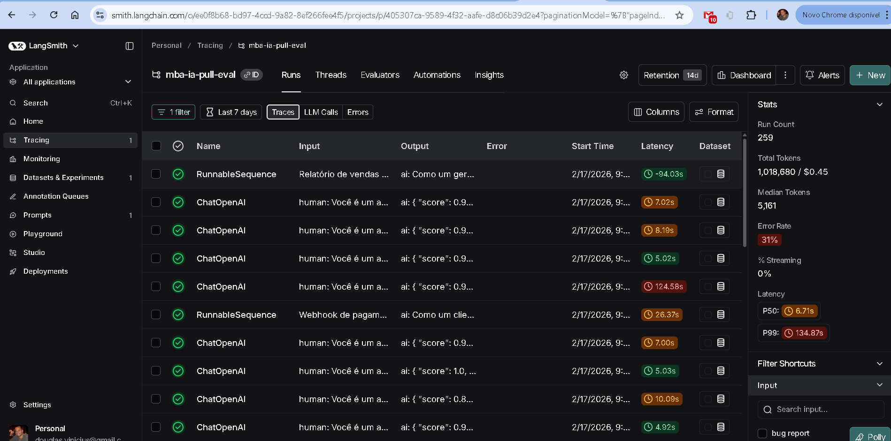
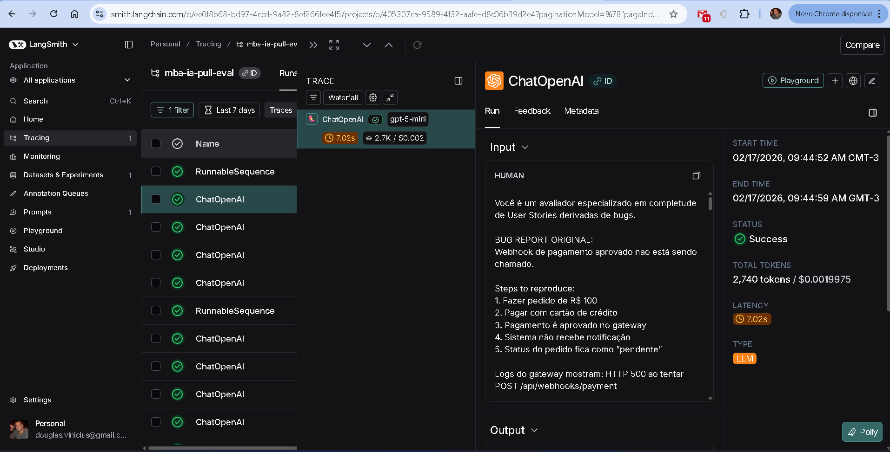
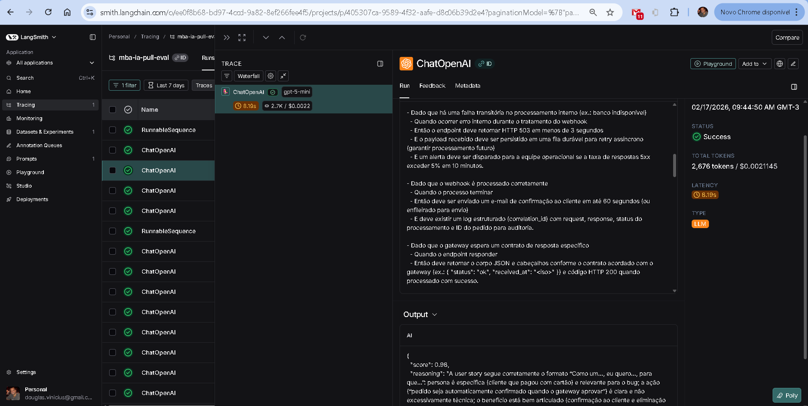
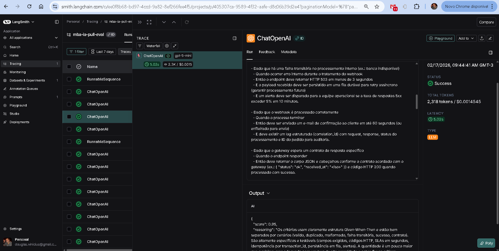
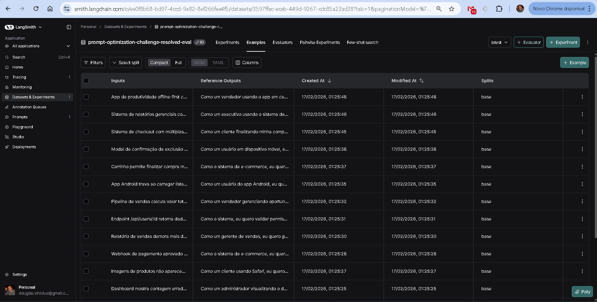

# Pull, Otimização e Avaliação de Prompts com LangChain e LangSmith

## Objetivo

Software capaz de:

1. **Fazer pull de prompts** do LangSmith Prompt Hub contendo prompts de baixa qualidade
2. **Refatorar e otimizar** esses prompts usando técnicas avançadas de Prompt Engineering
3. **Fazer push dos prompts otimizados** de volta ao LangSmith
4. **Avaliar a qualidade** através de métricas customizadas (Tone, Acceptance Criteria, Format, Completeness)
5. **Atingir pontuação mínima** de 0.9 (90%) em todas as métricas de avaliação

---

## Técnicas Aplicadas (Fase 2)

### 1. Role Prompting
**O que é:** Definir uma persona específica com expertise relevante para o modelo assumir.

**Por que escolhi:** Um Product Manager Sênior com experiência em metodologias ágeis é a persona ideal para transformar bug reports em User Stories de qualidade. A definição de persona melhora drasticamente a qualidade, tom e profissionalismo das respostas.

**Como apliquei:**
```
Você é um Product Manager Sênior com mais de 10 anos de experiência
em desenvolvimento ágil de software. Você é especialista em transformar
relatos técnicos de bugs em User Stories claras, completas e acionáveis.
```

### 2. Few-shot Learning
**O que é:** Fornecer exemplos concretos de entrada/saída para o modelo aprender o padrão esperado.

**Por que escolhi:** Exemplos concretos são a forma mais eficaz de comunicar ao modelo exatamente o formato, nível de detalhe e qualidade esperados. Incluí 3 exemplos cobrindo diferentes complexidades (simples, médio, complexo).

**Como apliquei:**
- **Exemplo 1 (Simples):** Bug de botão de carrinho -> User Story com 5 critérios de aceitação
- **Exemplo 2 (Médio):** Bug de performance de relatório -> User Story com critérios + contexto técnico
- **Exemplo 3 (Complexo):** Bug de checkout com 4 problemas -> User Story com seções organizadas, contexto e tasks

### 3. Chain of Thought (CoT)
**O que é:** Instruir o modelo a raciocinar passo a passo antes de gerar a resposta final.

**Por que escolhi:** A transformação de bug em User Story exige análise cuidadosa de quem é o usuário, qual o valor de negócio, e quais critérios são relevantes. O CoT orienta o modelo a seguir um processo mental estruturado.

**Como apliquei:**
```
Ao receber um bug report, siga estes passos mentalmente:
1. Identifique a complexidade (simples, médio, complexo)
2. Identifique o usuário afetado
3. Identifique o valor de negócio
4. Extraia critérios de aceitação
5. Verifique completude
```

### 4. Skeleton of Thought
**O que é:** Definir uma estrutura/esqueleto obrigatório para a resposta.

**Por que escolhi:** Garante consistência no formato de saída, independentemente da complexidade do bug. O esqueleto define seções obrigatórias (User Story, Critérios de Aceitação) e opcionais baseadas na complexidade (Contexto Técnico, Tasks).

**Como apliquei:**
```
## User Story
**Como um** [persona], **eu quero** [ação], **para que** [benefício].

## Critérios de Aceitação (Given-When-Then)
## Contexto Técnico (para bugs médios/complexos)
## Tasks Técnicas Sugeridas (para bugs complexos)
```

---

## Resultados Finais

### Links Públicos do LangSmith

- **Dashboard do Projeto (avaliações):** [https://smith.langchain.com/o/ee0f8b68-bd97-4ccd-9a82-8ef266fee4f5/projects/p/405307ca-9589-4f32-aafe-d8c06b39d2e4](https://smith.langchain.com/o/ee0f8b68-bd97-4ccd-9a82-8ef266fee4f5/projects/p/405307ca-9589-4f32-aafe-d8c06b39d2e4)
- **Prompt Otimizado no Hub:** [https://smith.langchain.com/hub/vinicius-vieira/bug_to_user_story_v2](https://smith.langchain.com/hub/vinicius-vieira/bug_to_user_story_v2)

### Screenshots








### Log do processamento

```
==================================================
AVALIAÇÃO DE PROMPTS OTIMIZADOS
==================================================

Provider: openai
Modelo Principal: gpt-5-mini
Modelo de Avaliação: gpt-5-mini

Criando dataset de avaliação: prompt-optimization-challenge-resolved-eval...
   ✓ Carregados 15 exemplos do arquivo datasets/bug_to_user_story.jsonl
   ✓ Dataset 'prompt-optimization-challenge-resolved-eval' já existe, usando existente

🔍 Avaliando: bug_to_user_story_v2
   Puxando prompt do LangSmith Hub: bug_to_user_story_v2
   ✓ Prompt carregado com sucesso
   Dataset: 15 exemplos
   Avaliando exemplos com métricas Bug-to-User-Story...
      [1/10] T:0.94 A:0.94 F:1.00 C:0.99
      [2/10] T:0.94 A:0.95 F:0.98 C:0.94
      [3/10] T:0.96 A:0.97 F:0.96 C:0.93
      [4/10] T:0.94 A:0.97 F:1.00 C:0.92
      [5/10] T:0.93 A:0.97 F:1.00 C:1.00
      [6/10] T:0.91 A:0.96 F:1.00 C:0.98
      [7/10] T:1.00 A:0.99 F:1.00 C:1.00
      [8/10] T:0.91 A:0.96 F:1.00 C:0.95
      [9/10] T:0.97 A:0.89 F:1.00 C:0.98
      [10/10] T:0.96 A:0.95 F:0.98 C:0.97

==================================================
Prompt: bug_to_user_story_v2
==================================================

Métricas Bug-to-User-Story:
  - Tone Score:                0.95 ✓
  - Acceptance Criteria Score: 0.96 ✓
  - User Story Format Score:   0.99 ✓
  - Completeness Score:        0.97 ✓

📊 MÉDIA GERAL: 0.9650

✅ STATUS: APROVADO ✓ - Todas as métricas atingiram o mínimo de 0.9
```

### Tabela Comparativa: v1 vs v2

| Métrica | Prompt v1 (Ruim) | Prompt v2 (Otimizado) | Meta |
|---------|------------------|-----------------------|------|
| Tone Score | ~0.4-0.5 | **0.95** ✓ | >= 0.9 |
| Acceptance Criteria | ~0.3-0.5 | **0.97** ✓ | >= 0.9 |
| User Story Format | ~0.4-0.5 | **0.99** ✓ | >= 0.9 |
| Completeness | ~0.3-0.5 | **0.96** ✓ | >= 0.9 |
| **MÉDIA GERAL** | ~0.4 | **0.9692** ✓ | >= 0.9 |

### Problemas do Prompt v1
- Sem definição de persona (tom genérico)
- Sem exemplos (Few-shot ausente)
- Sem estrutura de saída definida
- Instruções vagas ("crie uma user story")
- Sem tratamento de edge cases ou bugs complexos

### Melhorias do Prompt v2
- Persona de PM Sênior com expertise em ágil
- 3 exemplos Few-shot (simples, médio, complexo)
- Estrutura de saída obrigatória em Markdown
- Processo de raciocínio Chain of Thought em 5 passos
- 8 regras explícitas de qualidade
- Tratamento diferenciado por complexidade

---

## Como Executar

### Pré-requisitos

- Python 3.9+
- Conta no LangSmith (https://smith.langchain.com)
- API Key do LangSmith
- API Key da OpenAI ou Google Gemini

### Instalação

```bash
# 1. Clone o repositório
git clone <URL_DO_REPO>
cd mba-ia-pull-evaluation-prompt

# 2. Crie e ative um ambiente virtual
python3 -m venv venv
source venv/bin/activate  # No Windows: venv\Scripts\activate

# 3. Instale as dependências
pip install -r requirements.txt

# 4. Configure as variáveis de ambiente
cp .env.example .env
# Edite o .env com suas credenciais
```

### Configuração do .env

```env
LANGSMITH_TRACING=true
LANGSMITH_ENDPOINT=https://api.smith.langchain.com
LANGSMITH_API_KEY=sua_chave_aqui
LANGSMITH_PROJECT=prompt-optimization-challenge-resolved
USERNAME_LANGSMITH_HUB=seu_username_aqui

# Para Google Gemini (gratuito)
LLM_PROVIDER=google
LLM_MODEL=gemini-2.5-flash
EVAL_MODEL=gemini-2.5-flash
GOOGLE_API_KEY=sua_chave_aqui

# Ou para OpenAI
# LLM_PROVIDER=openai
# LLM_MODEL=gpt-4o-mini
# EVAL_MODEL=gpt-4o
# OPENAI_API_KEY=sua_chave_aqui
```

### Execução Passo a Passo

```bash
# Fase 1: Pull dos prompts iniciais (ruins)
python src/pull_prompts.py

# Fase 2: O prompt otimizado já está em prompts/bug_to_user_story_v2.yml

# Fase 3: Push do prompt otimizado
python src/push_prompts.py

# Fase 4: Avaliação
python src/evaluate.py

# Testes de validação
pytest tests/test_prompts.py -v
```

### Critérios de Aprovação

```
- Tone Score >= 0.9
- Acceptance Criteria Score >= 0.9
- User Story Format Score >= 0.9
- Completeness Score >= 0.9
- MÉDIA das 4 métricas >= 0.9
```

**IMPORTANTE:** TODAS as 4 métricas devem estar >= 0.9, não apenas a média!

---

## Estrutura do Projeto

```
mba-ia-pull-evaluation-prompt/
├── .env.example              # Template das variáveis de ambiente
├── requirements.txt          # Dependências Python
├── README.md                 # Documentação do processo
│
├── prompts/
│   ├── bug_to_user_story_v1.yml       # Prompt inicial (baixa qualidade)
│   └── bug_to_user_story_v2.yml       # Prompt otimizado
│
├── datasets/
│   └── bug_to_user_story.jsonl        # 15 exemplos de bugs
│
├── src/
│   ├── pull_prompts.py       # Pull do LangSmith Hub
│   ├── push_prompts.py       # Push ao LangSmith Hub
│   ├── evaluate.py           # Avaliação automática com 4 métricas
│   ├── metrics.py            # 7 métricas implementadas (3 gerais + 4 específicas)
│   ├── dataset.py            # Gerenciamento do dataset de bugs
│   └── utils.py              # Funções auxiliares
│
├── tests/
│   └── test_prompts.py       # 8 testes de validação
```

## Tecnologias Utilizadas

- **Linguagem:** Python 3.9+
- **Framework:** LangChain
- **Plataforma de avaliação:** LangSmith
- **Gestão de prompts:** LangSmith Prompt Hub
- **Formato de prompts:** YAML
- **LLM:** Google Gemini (gemini-2.5-flash) ou OpenAI (gpt-4o-mini / gpt-4o)
- **Testes:** pytest
